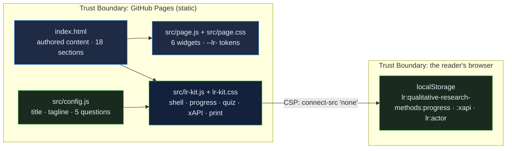

# Qualitative Research Methods: a graduate-level guide from paradigm to defensible finding, with a design selector, a coding walkthrough and a rigor self-check

[](https://github.com/Freddricklogan/qualitative-research-methods/actions/workflows/deploy.yml)
[](#5-getting-started--verification)
[](https://github.com/Freddricklogan/qualitative-research-methods/actions/workflows/codeql.yml)
[](LICENSE)
[](https://freddricklogan.github.io/qualitative-research-methods/)

## 1. Executive Summary & Business Impact

**Problem statement.** Doctoral students and practitioner-researchers choose a qualitative design by habit — interviews because interviews are familiar — and reach the defence unable to say which paradigm they stand in, why their sample is adequate, or what makes their themes trustworthy. Textbooks cover each piece; few let a reader try the decisions.

**Solution & value delivered.** An eighteen-section resource that moves from paradigms through the five approaches, sampling, data collection, analysis and trustworthiness to writing up, with widgets that make the reader decide: a design selector that suggests an approach from three answers, a coding walkthrough that lifts one quote from datum to theme, a rigor scorer over Lincoln and Guba's criteria, and a self-quiz matching questions to approaches. The page is one of ten
resources built on the shared
[Learning Resource Kit](https://github.com/Freddricklogan/learning-resource-kit):
an Executive Shell with live counts, collapsible sections whose progress is
saved in the reader's browser, a five-question quiz written for this
resource that records xAPI 1.0.3 statements locally, and a print layout that
opens every section. Nothing leaves the page; the content-security policy
forbids network calls.

**[→ Read the full case study](docs/CASE_STUDY.md)**

| Outcome | How this repo delivers it |
| --- | --- |
| A resource, not a slide deck | 18 sections (18 minutes at 230 wpm) with an executive summary first: orientation, paradigms, the five approaches, side-by-side comparison, design selector, nine-stage workflow, research question, sampling, data sources, interview guide, analysis, mixed methods, trustworthiness, ethics, writing up, pitfalls, FAQ, glossary |
| Interactive where it matters | 6 authored widgets (see §4) kept intact through the conversion and verified under a strict CSP |
| Evidence of learning | Quiz answers and completion recorded as xAPI statements with an anonymous actor; inspectable on the page |
| Reviewable by an institution | No inline script or style, typed buttons, table bodies, a `<main>` landmark; html-validate and ESLint in CI |
| Usable everywhere | Keyboard-operable sections, deep links that open their section, print stylesheet, no horizontal scroll at 400 px |

## 2. Demonstrated Competencies & Technical Skills

- **EdTech & Human-Centered Design** — decisions before definitions: the design selector, coding ladder and rigor scorer each ask the reader to commit before the page explains; a glossary and FAQ close the loop; sections are collapsible so the executive summary reads in two minutes.
- **Systems Architecture & CS** — authored content in `index.html`, its
  widgets in `src/page.js`, its styles in `src/page.css` under the `--lr-`
  namespace; the kit vendored as `src/lr-kit.js`; config and tests that
  fail CI if a quiz question is malformed.
- **Cybersecurity & Compliance** — `default-src 'none'; script-src 'self';
  connect-src 'none'`; no third-party script; Trivy, npm audit and CodeQL in
  CI.
- **Data Science & AI** — reading time and section counts computed from the
  content at load; scores recorded as scaled results, never claimed.

## 3. System Architecture & Data Flow



## 4. Technical Highlights & Engineering Decisions

### The authored widgets

| Widget | What it does |
| --- | --- |
| Approach tabs | Five tabs (narrative, phenomenology, grounded theory, ethnography, case study) switch the detail panel |
| Design selector | Three questions about intent; tallies the answers and suggests an approach with a rationale, flagging split answers |
| Coding walkthrough | Steps one participant quote up four rungs — raw datum, code, category, theme — with a hint per rung |
| Rigor scorer | Weighted checklist of nine trustworthiness strategies; fills a bar and gives an Emerging / Solid / Strong verdict |
| Self-quiz | Five research questions to match to the right approach, with the correct answer revealed on a miss |
| FAQ accordion | Expandable answers to common design questions |

### ADR-1 — Convert, do not rewrite

**Context.** The original was one hand-authored file: rich content and
bespoke widgets, but inline styles and scripts that no content-security
policy or validator accepts.

**Decision.** The kit's converter moved the stylesheet and scripts out of
the page, replaced 124 inline style attributes with
35 generated classes, namespaced 26 custom properties, typed
27 buttons, gave 6 tables a body and wrapped the content in a `<main>` landmark. The content and
widget code were not rewritten; `AUDIT.md` lists every change.

**Consequence.** The page passes html-validate under a strict CSP with its
original behaviour intact, and the change is auditable line by line.

### ADR-2 — One quiz, one attempt, standard statements

**Context.** The page's own self-checks vanish on reload and record nothing.

**Decision.** Five questions written from this resource's content live in
`src/config.js`; the kit accepts a single attempt per question, shows the
explanation, and records xAPI *answered* and *completed* statements with a
scaled score, kept in the browser and shown as JSON.

**Consequence.** The score reflects what the reader knew before the
explanation, and an institution can see the exact statements a learning
record store would receive.

### ADR-3 — Progress means opened

**Context.** Scroll depth is easy to measure and says little about reading.

**Decision.** A section counts as opened when its collapsed state is
removed — by click, keyboard, deep link or "Expand all" — and an
*experienced* statement is recorded once.

**Consequence.** The KPI strip is conservative: 18 sections, and the count
only rises when the reader opens one.

## 5. Getting Started & Verification

**Prerequisites.** Node 22 for the checks; the page itself needs only a
browser.

```bash
git clone https://github.com/Freddricklogan/qualitative-research-methods.git
cd qualitative-research-methods
npm ci
npm run check     # eslint → html-validate → vitest
npx serve .       # open http://localhost:3000
```

**Verification — the numbers this repository actually produced:**

```bash
npm run lint      # 0 problems
npm run validate  # html-validate index.html: clean
npm run coverage  # 14 passed; All files 79.55% (config.js 100%, vendored lr-kit.js 78.54%)
```

| Check | Result |
| --- | --- |
| Unit tests (Vitest, jsdom) | **7 passed / 7** across 2 files — quiz validity, page invariants, the kit mounted on this page |
| Coverage | All files **79.55%** statements: `src/config.js` 100%, vendored `src/lr-kit.js` 78.54% from this page's smoke test (the kit's own suite covers it at 99%) |
| ESLint, html-validate | clean |
| Conversion audit | 124 inline styles → 35 classes · 26 tokens namespaced · 27 buttons typed · 6 tables fixed |
| Headless Chrome smoke | **0 console errors**; all 6 widgets exercised; sections opened 18/18 on Expand all; no horizontal scroll at 1200 or 400 px |

## 6. Live Demo & Production Showcase

**<https://freddricklogan.github.io/qualitative-research-methods/>**

**30-second guided walkthrough.** Press **Take the 30-second tour**.

1. **A graduate-level resource, not a slide deck** — 18 sections, about
   18 minutes of reading.
2. **Open a section** — the first section opens and the count rises.
3. **Check your understanding** — five questions on paradigms, sampling, saturation, trustworthiness and coding.
4. **Your statements, inspectable** — the xAPI JSON recorded in this browser.

The quiz covers:
- the constructivist paradigm and its neighbours
- Patton's critical-case logic
- what a saturation claim requires
- dependability and the audit trail
- the code → category → theme ladder

Part of the resource hub at <https://freddricklogan.github.io/resources/>.
